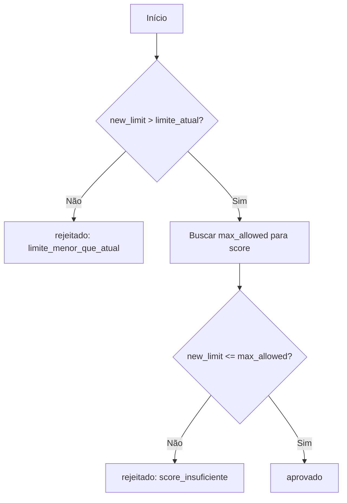
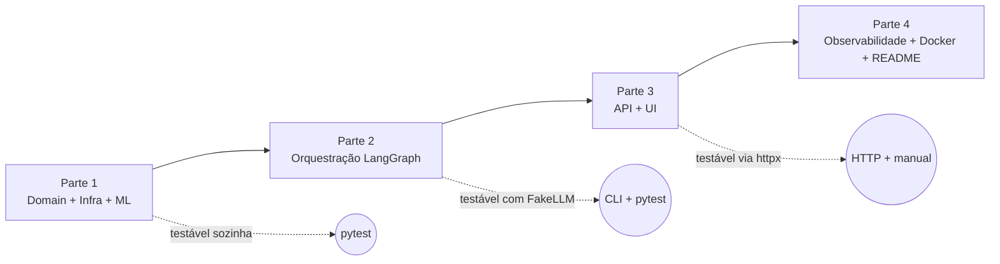

# Prompt de Implementação — Banco Ágil (Agentes de IA)

> **Como usar este documento:** ele é um **prompt de implementação executável**. Cada Parte é um entregável **autocontido e validável isoladamente**. Implemente na ordem (1 → 4). Uma Parte **nunca** depende de uma Parte posterior para ser testada. Ao final de cada Parte há um **Critério de Validação** que deve passar antes de avançar.
>
> **Documento-mãe:** decisões de arquitetura e justificativas estão em [`docs/ESTRATEGIA-IMPLEMENTACAO.md`](docs/ESTRATEGIA-IMPLEMENTACAO.md). Este arquivo é o **passo a passo**; aquele é o **porquê**.

---

## Sumário

- [Regras globais (respeitar em TODAS as partes)](#regras-globais-respeitar-em-todas-as-partes)
- [Padrão de documentação obrigatório](#padrão-de-documentação-obrigatório)
- [Mapa de dependências entre as partes](#mapa-de-dependências-entre-as-partes)
- [Parte 1 — Fundação (Domain + Infraestrutura + ML)](#parte-1--fundação-domain--infraestrutura--ml)
- [Parte 2 — Orquestração (LangGraph)](#parte-2--orquestração-langgraph)
- [Parte 3 — API + Interface (FastAPI + Streamlit)](#parte-3--api--interface-fastapi--streamlit)
- [Parte 4 — Observabilidade, Hardening, Docker e README](#parte-4--observabilidade-hardening-docker-e-readme)
- [Matriz de validação independente](#matriz-de-validação-independente)

---

## Convenção de commits (obrigatória)

Todo trabalho (código **e** documentação) deve ser commitado em commits **atômicos**, no padrão [Conventional Commits](https://www.conventionalcommits.org/):

```
<type>(<scope opcional>): <resumo no imperativo, até ~72 chars>

[corpo opcional: por quê / contexto]
```

| Type | Quando usar |
|---|---|
| `docs` | Estratégia, prompt, fluxogramas, README, comentários de documentação |
| `feat` | Nova funcionalidade de produto |
| `fix` | Correção de bug |
| `test` | Testes novos ou ajustes de cobertura |
| `refactor` | Mudança interna sem alterar comportamento |
| `chore` | Scaffold, tooling, deps, `.gitignore` |
| `ci` | Pipelines / automação |

**Regras:**
1. Um commit = uma intenção. Não misturar docs com feat sem necessidade.
2. Documentação (incluindo fluxogramas 🟡→✅) entra em commit `docs:` no **mesmo lote lógico** da mudança que documenta — ou em commit `docs:` imediatamente seguinte se o diff for grande.
3. Nunca commitar `.env`, secrets, `__pycache__`, `.joblib` gerados, `.coverage`.
4. Mensagem em inglês técnico ou PT-BR consistente com o histórico do repo; preferir **por quê** no corpo quando a mudança não for óbvia.

---

## Regras globais (respeitar em TODAS as partes)

Estas regras são **inegociáveis** e valem para todo código produzido.

### Engenharia

1. **Python 3.11+** com **type hints completos**. `Any` só com justificativa em comentário. `Pyright` em modo `strict` deve passar limpo.
2. **`Ruff`** (lint + format) deve passar sem erros. Configurar em `pyproject.toml`.
3. **Pydantic v2** para todo modelo de dados que cruza fronteira (API, domínio, config, entrada do usuário).
4. **`pathlib`** para arquivos; **nunca** concatenação de strings de caminho.
5. **Separação de Preocupações (SoC):** domínio (regra de negócio) **não** conhece I/O, HTTP, LLM ou framework. Dependências apontam para dentro (Clean Architecture-lite).
6. **Injeção de Dependência:** services e classifiers recebem suas dependências (repositories, encoders) via construtor — nunca instanciam I/O internamente. Facilita mock em testes.
7. **`logging` estruturado com `structlog`** — proibido `print()` em código de produção (permitido em `scripts/`).
8. **Zero segredo hardcoded.** Tudo via `pydantic-settings` lendo `.env`. Commitar apenas `.env.example`.
9. **KISS + DRY:** a solução mais simples que atende ao escopo vence. Não antecipar requisitos futuros.

### Regras de negócio (do desafio)

10. **"LLM conversa, código decide":** LLM nunca faz matemática, aprovação financeira ou I/O de arquivo. Isso é sempre código Python tipado via tools/services.
11. **Padronização de status:** usar **sempre** `pendente` | `aprovado` | `rejeitado` (nunca `reprovado`).
12. **Dependentes `3+`:** `num_dependentes >= 3` usa peso 30.
13. **Transição implícita:** nenhuma mensagem ao cliente pode mencionar "agente", "setor", "transferência". Persona única.
14. **Encerramento:** qualquer pedido de fim → tool `end_conversation` → estado `should_end=True`.
15. **Tratamento de erro controlado:** nunca vazar stack trace ao cliente; sempre oferecer caminho (retry, alternativa, encerrar). Todo componente de ML **degrada graciosamente**.
16. **PII:** `cpf` mascarado (`***`) em logs/traces; `data_nascimento` **nunca** logada.

### Testes

17. Cada Parte entrega seus próprios testes. **Nada de LLM real em teste automatizado** — usar `FakeLLM`/mocks.
18. Cobertura mínima do **domínio e infra**: caminhos felizes + de erro + bordas (limites 0/1000, 3 tentativas, faixas de score).

---

## Padrão de documentação obrigatório

> Objetivo: qualquer pessoa entende **como cada coisa funciona** sem ler a implementação linha a linha.

### Regra 1 — Docstring em TODA função, método e classe públicos

Padrão **Google**. Template mínimo:

```python
def evaluate_request(
    customer: Customer, new_limit: float, score_repo: ScoreLimitRepository
) -> CreditDecision:
    """Decide aprovação de aumento de limite com base no score do cliente.

    Regra: aprova se `new_limit` > limite atual E <= limite máximo permitido
    para a faixa de score do cliente (tabela score_limite.csv).

    Args:
        customer: Cliente autenticado (contém score e limite atual).
        new_limit: Novo limite solicitado, em reais.
        score_repo: Fonte da tabela score → limite máximo.

    Returns:
        CreditDecision com status ('aprovado'|'rejeitado') e motivo/valor.

    Raises:
        ScoreTableError: Se a faixa de score do cliente não existir na tabela.
    """
```

Classes recebem docstring explicando **responsabilidade** e **colaboradores** (dependências).

### Regra 2 — Fluxograma Mermaid para unidades com lógica não-trivial

**Gerar fluxograma para:** nós do grafo, funções de roteamento (edges), services de domínio com ramificação, repositories com escrita atômica, classifiers (router semântico e safety), e o ciclo de vida de solicitação de crédito.

**NÃO gerar fluxograma para:** DTOs/Pydantic models, getters, dataclasses, funções triviais de 1–3 linhas sem ramificação (a docstring basta).

**Localização:** `docs/fluxogramas/parte-<N>-<nome>.md`. Um diagrama por unidade, com título = nome qualificado (`módulo.Classe.metodo`). A convenção completa (nomenclatura, legenda de status 🔲/🟡/✅, sincronização) está em [`docs/fluxogramas/README.md`](docs/fluxogramas/README.md), que já contém os esqueletos das 4 partes.

**Exemplo de entrada no arquivo de fluxogramas:**

````markdown
### `domain.credit_limit.CreditLimitService.evaluate_request`


````

### Regra 3 — Cabeçalho de módulo

Todo arquivo `.py` começa com docstring de módulo (1–3 linhas) dizendo seu papel na arquitetura.

---

## Mapa de dependências entre as partes



**Invariante:** a seta aponta sempre para frente. Nenhuma Parte importa código de uma Parte posterior. Se você sentir necessidade disso, o design está errado — pare e revise.

---

## Parte 1 — Fundação (Domain + Infraestrutura + ML)

> **Independência:** 100%. Não usa LLM, LangGraph, FastAPI nem Streamlit. Validável somente com `pytest` e scripts CLI.

### Objetivo

Entregar o **núcleo determinístico**: modelos, regras de negócio, persistência em CSV (concorrente e atômica) e os classifiers de ML treinados. Tudo o que "o código decide".

### Pré-requisitos

Nenhum (é a base).

### Escopo — arquivos a criar

```
pyproject.toml, .env.example, .gitignore
src/banco_agil/__init__.py
src/banco_agil/config.py
src/banco_agil/domain/{models.py, auth.py, scoring.py, credit_limit.py, interview.py, errors.py}
src/banco_agil/infrastructure/{csv_repository.py, customer_repository.py,
    credit_request_repository.py, score_limit_repository.py, fx_client.py}
src/banco_agil/ml/{embeddings.py, intent_router.py, safety_classifier.py}
src/banco_agil/utils/{cpf.py, currency.py, dates.py}
data/{clientes.csv, score_limite.csv, intents.jsonl, safety_samples.jsonl}
scripts/{seed_data.py, train_router.py, train_safety.py}
tests/unit/*, tests/integration/test_repositories.py
docs/fluxogramas/parte-1-fundacao.md
```

### Detalhamento por módulo

#### `config.py`
- **Classe `Settings(BaseSettings)`** (pydantic-settings): `llm_provider`, `groq_api_key`, `langfuse_*`, `fx_api_url`, `embeddings_model`, `router_confidence_threshold`, `safety_enabled`, `safety_threshold`, `checkpointer_db`, `data_dir`, `models_dir`.
- Fornecer `get_settings()` com `@lru_cache`. **Como:** ler `.env`; validar tipos; falhar cedo se faltar chave obrigatória.

#### `domain/models.py` (Pydantic v2, sem I/O)
- `Customer` (`cpf`, `data_nascimento: date`, `nome`, `limite_atual: float`, `score: int` 0–1000).
- `CreditRequest` (`request_id`, `cpf_cliente`, `data_hora_solicitacao: datetime`, `limite_atual`, `novo_limite_solicitado`, `status_pedido`).
- `InterviewInput` (validações da seção 11 da ESTRATEGIA: `renda_mensal>0`, `tipo_emprego` Literal, `despesas_fixas>=0`, `num_dependentes` 0–20, `tem_dividas` Literal; `field_validator` para parse de moeda BR).
- `CreditDecision` (`status`, `reason: str | None`, `approved_limit: float | None`).
- `ScoreBand` (`score_min`, `score_max`, `limite_max_permitido`).
- **Fluxograma:** não (são DTOs). Apenas docstrings.

#### `domain/errors.py`
- Hierarquia de exceções de domínio: `DomainError` → `CustomerNotFoundError`, `ScoreTableError`, `AuthenticationError`, `PersistenceError`. **Regra:** domínio lança essas; camadas externas traduzem para mensagem ao cliente.

#### `domain/auth.py` — `AuthService`
- `authenticate(cpf, birth_date, repo) -> Customer | None`.
- **Como:** normalizar CPF (`utils.cpf`), buscar no repo, comparar `data_nascimento`. Sem efeito colateral.
- **Fluxograma:** sim.

#### `domain/scoring.py` — `ScoringService`
- Constantes de peso (seção 9.2 da ESTRATEGIA) + `calculate_score(data: InterviewInput) -> int` com `max(0, min(1000, ...))`.
- **Fluxograma:** sim (cálculo + clamp + regra 3+).

#### `domain/credit_limit.py` — `CreditLimitService`
- `evaluate_request(customer, new_limit, score_repo) -> CreditDecision`. Regra `limite_menor_que_atual` documentada como decisão de negócio.
- **Fluxograma:** sim.

#### `infrastructure/csv_repository.py` — base
- **Classe `AtomicCsvStore`:** leitura (`csv.DictReader`), escrita atômica (**escreve em `.tmp` no mesmo diretório + `os.replace`**), `filelock.FileLock` para concorrência entre processos.
- **Como:** todo rewrite passa por temp+replace; nunca abrir o arquivo destino em modo `w` diretamente.
- **Fluxograma:** sim (fluxo de escrita atômica com lock).

#### `infrastructure/customer_repository.py` — `CsvCustomerRepository(CustomerRepository)`
- `find_by_cpf`, `authenticate`, `update_score`, `update_limit`. Implementa `Protocol` do domínio.
- **Fluxograma:** sim para `update_score`/`update_limit` (read-modify-write atômico).

#### `infrastructure/credit_request_repository.py` — `CsvCreditRequestRepository`
- `create(request) -> request_id` (grava **`pendente`**); `update_status(request_id, status)` (atualiza a **mesma** linha).
- **Fluxograma:** sim (ciclo de vida pendente → aprovado/rejeitado).

#### `infrastructure/score_limit_repository.py` — `CsvScoreLimitRepository`
- `get_max_limit_for_score(score) -> float`. Lança `ScoreTableError` se faixa inexistente.

#### `infrastructure/fx_client.py` — `FxClient`
- `get_rate(currency: str) -> ExchangeRate` via `httpx` com timeout, retry e cache TTL 60s. Suportar `FX_MOCK=true`.
- **Regra:** normalizar código de moeda ISO; validar contra pares suportados (não whitelist fixa curta).
- **Fluxograma:** sim (rate + retry + cache + mock).

#### `ml/embeddings.py` — `EmbeddingsProvider` (Protocol) + `SentenceTransformerEmbeddings`
- Carrega o modelo 1x; `encode(texts, normalize=True) -> np.ndarray`. Injetável.

#### `ml/intent_router.py` — `SemanticIntentRouter`
- `predict(text) -> RouteResult | None` (None quando confiança < threshold OU artefato ausente → sinaliza fallback).
- **Fluxograma:** sim (embedding → proba → threshold → None/RouteResult).

#### `ml/safety_classifier.py` — `SafetyClassifier`
- `check(text) -> SafetyResult`. Combina **denylist regex** + modelo; `blocked = regex_hit or (label!='ok' and score>=threshold)`. Degrada para regex-only sem artefato.
- **Fluxograma:** sim.

#### `utils/`
- `cpf.normalize_cpf`, `cpf.is_valid_cpf` (dígitos verificadores, opcional); `currency.normalize_brazilian_currency` (`"5.000,00" → 5000.0`); `dates.parse_flexible_date` (`DD/MM/YYYY` e `YYYY-MM-DD`).

#### `scripts/`
- `seed_data.py`: gera `clientes.csv` e `score_limite.csv` (dados fictícios coerentes). `train_router.py` e `train_safety.py`: treinam, imprimem `classification_report`, persistem `.joblib` em `models/`.

### Documentação obrigatória da Parte 1
- Docstrings Google em **todas** as unidades acima.
- `docs/fluxogramas/parte-1-fundacao.md` com os fluxogramas marcados como "sim".

### Testes da Parte 1
- `test_scoring.py`, `test_credit_limit.py`, `test_auth.py`, `test_interview_input.py`, `test_intent_router.py`, `test_safety_classifier.py`, `integration/test_repositories.py` (inclui verificação de atomicidade e `update_status`).

### ✅ Critério de Validação (independente)
```bash
ruff check . && ruff format --check .
pyright
python scripts/seed_data.py && python scripts/train_router.py && python scripts/train_safety.py
pytest tests/unit tests/integration -v --cov=src/banco_agil --cov-report=term-missing
```
**Esperado:** lint/types limpos; artefatos `.joblib` gerados; todos os testes verdes. **Sem** LLM, API ou UI envolvidos.

### 🚫 Não fazer nesta Parte
LangGraph, tools de LLM, FastAPI, Streamlit, Langfuse, Docker.

---

## Parte 2 — Orquestração (LangGraph)

> **Independência:** depende **apenas** da Parte 1. Validável por script CLI + testes com `FakeLLM`. **Sem** API nem UI.

### Objetivo
Montar a máquina de estados conversacional: estado, nós, edges, tools (com mutação via `Command`), `checkpointer` (multi-turno) e integração do roteador semântico + guard.

### Pré-requisitos
Parte 1 concluída e validada.

### Escopo — arquivos a criar
```
src/banco_agil/graph/{state.py, workflow.py, edges.py}
src/banco_agil/graph/nodes/{guard.py, triage.py, router.py, credit.py, interview.py, exchange.py, safe_reply.py, end.py}
src/banco_agil/agents/{persona.py, prompts.py}
src/banco_agil/tools/{auth_tools.py, credit_tools.py, interview_tools.py, exchange_tools.py, session_tools.py}
src/banco_agil/infrastructure/session_checkpointer.py
src/banco_agil/cli.py                      # loop de chat no terminal (validação manual)
tests/unit/test_routing.py
tests/integration/test_graph_flow.py
docs/fluxogramas/parte-2-orquestracao.md
```

### Detalhamento

#### `graph/state.py` — `SessionState(TypedDict)`
Conforme seção 7.1 da ESTRATEGIA (auth, roteamento, segurança, crédito, entrevista, controle, observabilidade). Reducer `add_messages` em `messages`.

#### `graph/edges.py` — funções puras de roteamento
`route_after_guard`, `route_after_triage`, `route_after_router`, `route_after_credit`, `route_after_interview` (seção 7.3 da ESTRATEGIA). **Puras e determinísticas** → alvo principal de `test_routing.py`.
- **Fluxograma:** sim (um por função).

#### `graph/nodes/*` — um nó por arquivo
- `guard`: chama `SafetyClassifier`; seta `input_blocked`/`safety_*`.
- `triage`: coleta CPF+data (multi-turno), autentica, controla `auth_attempts` (só conta par completo que falha).
- `router`: **hub**; usa `SemanticIntentRouter` com fallback LLM (`identify_intent`).
- `credit`, `interview`, `exchange`: skills; **sempre retornam ao `router`**.
- `safe_reply`, `end`: respostas terminais do turno.
- **Fluxograma:** sim para `guard`, `triage`, `router` (os de maior ramificação).

#### `tools/*` — `@tool` com mutação via `Command`
Conforme seção 10.1 da ESTRATEGIA. Tools de leitura retornam dados; tools de ação retornam `Command(update=...)`. **Nenhuma tool faz I/O direto** — só via services/repos da Parte 1.
- **Fluxograma:** sim para `request_limit_increase` (create pendente → evaluate → update_status).

#### `infrastructure/session_checkpointer.py`
Fábrica do `SqliteSaver` (arquivo `data/sessions.sqlite`). **Como:** injetado no `graph.compile(checkpointer=...)`.

#### `graph/workflow.py` — `build_graph() -> CompiledGraph`
Registra nós, edges condicionais e compila com checkpointer. Documentar o **modelo de turnos**: retornar `END` encerra o turno; próximo `invoke` com mesmo `thread_id` resume.
- **Fluxograma:** sim (topologia geral do grafo).

#### `cli.py`
Loop `input()` → `graph.invoke(..., config={"configurable": {"thread_id": session_id}})` → imprime resposta. Usa `FakeLLM` ou provider real conforme `.env`. É a **ferramenta de validação manual** desta Parte.

### Testes da Parte 2
- `test_routing.py`: todas as funções de edge (3 tentativas → end; hub retorna ao router; rejeitado+aceite → interview; `input_blocked` → safe_reply).
- `test_graph_flow.py`: com `FakeLLM` determinístico, exercitar fluxo multi-turno e provar que o estado **resume** entre `invoke`s.

### ✅ Critério de Validação (independente)
```bash
pytest tests/unit/test_routing.py tests/integration/test_graph_flow.py -v
python -m banco_agil.cli   # sessão manual: login → limite → aumento → rejeição → entrevista → aprovação → câmbio → encerrar
```
**Esperado:** testes verdes; sessão CLI completa funcionando, com transição implícita e persistência entre turnos. **Sem** subir API/UI.

### 🚫 Não fazer nesta Parte
FastAPI, Streamlit, Langfuse (a fiação vem na Parte 4). Nada de I/O de arquivo dentro de nós/tools que não passe pela Parte 1.

---

## Parte 3 — API + Interface (FastAPI + Streamlit)

> **Independência:** depende das Partes 1–2. Validável via `httpx` (API) e navegação manual (UI). **Não** requer Langfuse nem Docker.

### Objetivo
Expor o grafo via HTTP e entregar a UI de duas abas (Cliente + Backoffice).

### Pré-requisitos
Partes 1–2 concluídas e validadas.

### Escopo — arquivos a criar
```
src/banco_agil/main.py
src/banco_agil/api/schemas.py
src/banco_agil/api/routes/{chat.py, session.py, health.py}
src/banco_agil/ui/streamlit_app.py
tests/integration/test_api.py
docs/fluxogramas/parte-3-api-ui.md
```

### Detalhamento

#### `api/schemas.py`
`ChatRequest(session_id, message)`, `ChatResponse(reply, session_id, metadata)`, `ChatMetadata(active_agent, authenticated, intent, route, safety, last_tool_calls, last_score_calculation, langfuse_trace_url)`. Pydantic v2.

#### `api/routes/chat.py` — `POST /chat`
- **Como:** recebe `{session_id, message}`; **reconstrói estado via checkpointer** (`thread_id=session_id`); invoca o grafo; monta `ChatResponse` a partir do estado resultante. Traduz erros de domínio em mensagem amigável (nunca stack trace).
- **Fluxograma:** sim (request → invoke → montagem de metadata → response, com ramo de erro).

#### `api/routes/session.py` — `GET /session/{id}`
Retorna snapshot do estado para a aba Backoffice (opcional).

#### `api/routes/health.py` — `GET /health`
Health check simples (usado pelo Docker na Parte 4).

#### `main.py`
Cria `FastAPI`, injeta `build_graph()` (singleton no `lifespan`), registra rotas.

#### `ui/streamlit_app.py`
- **Tab Cliente:** chat limpo, input, botão "Encerrar", `session_id = uuid4()` na 1ª carga, histórico em `st.session_state`.
- **Tab Backoffice:** agente ativo, estado, **roteamento** (`route.source`/`confidence`), **segurança** (`safety.label`/score), tools executadas (args mascarados), score JSON, preview do CSV de solicitações. (Langfuse link fica cinza até a Parte 4.)
- **Como:** chama a API via `httpx`; nunca acessa domínio direto.
- **Fluxograma:** sim (ciclo de interação Cliente → API → render das duas abas).

### Testes da Parte 3
- `test_api.py`: `TestClient` do FastAPI cobrindo `/health`, `/chat` (com `FakeLLM`), tradução de erro e formato do `metadata`.

### ✅ Critério de Validação (independente)
```bash
pytest tests/integration/test_api.py -v
uvicorn banco_agil.main:app --reload      # abrir http://localhost:8000/docs
streamlit run src/banco_agil/ui/streamlit_app.py   # navegar as duas abas
```
**Esperado:** endpoints respondendo, contrato JSON correto, UI navegável end-to-end. **Sem** Langfuse/Docker.

### 🚫 Não fazer nesta Parte
Integração Langfuse, Dockerfile/compose, README final (Parte 4).

---

## Parte 4 — Observabilidade, Hardening, Docker e README

> **Independência:** camada de acabamento sobre 1–3. Cada item é validável de forma isolada.

### Objetivo
Tornar o sistema "production-aware" e pronto para entrega: rastreamento, logs, contêineres e documentação.

### Pré-requisitos
Partes 1–3 concluídas e validadas.

### Escopo — arquivos a criar/alterar
```
src/banco_agil/infrastructure/langfuse_tracer.py
src/banco_agil/observability/logging.py       # structlog + redaction de PII
(integração dos callbacks Langfuse no invoke do grafo)
docker/Dockerfile, docker-compose.yml
README.md
docs/fluxogramas/parte-4-observabilidade.md
```

### Detalhamento

#### `observability/logging.py`
Configura `structlog` com processador de **redaction** (mascara `cpf`, remove `data_nascimento`). Exporta `get_logger()`.

#### `infrastructure/langfuse_tracer.py`
- `CallbackHandler` do Langfuse plugado no `invoke`; spans `node:guard`, `node:router`, `agent:*`, `tool:*`; eventos `input_blocked`, `router_fallback_llm`, `auth_failed`, `credit_rejected`; `get_trace_url()` para a response. Degrada se Langfuse indisponível (app segue).
- **Fluxograma:** sim (trace/span/eventos por nó).

#### `docker/Dockerfile`
Multi-stage, imagem `slim`, **usuário não-root**, só o necessário em runtime.

#### `docker-compose.yml`
Serviços `api` e `ui` conforme seção 16 da ESTRATEGIA: `healthcheck` na API + `depends_on: {api: {condition: service_healthy}}`; volumes `./data` e `./models`.

#### `README.md`
Seções obrigatórias do PDF: Visão Geral, Arquitetura (Mermaid), Funcionalidades (checklist mapeado), Desafios e Soluções, Escolhas Técnicas (LangGraph vs CrewAI, roteador semântico, safety com **limitações declaradas**), Tutorial de execução e testes. + Extras: screenshots Langfuse/Backoffice, roadmap.

### Testes da Parte 4
- Smoke test de logging (redaction efetiva); verificação de que a ausência de Langfuse não quebra `/chat`; `docker compose up` sobe e `/health` responde.

### ✅ Critério de Validação (final / entrega)
```bash
docker compose up --build      # UI :8501, API :8000
# roteiro demo: login → limite → aumento → rejeição → entrevista → aprovação → câmbio → encerrar
# conferir trace no Langfuse e CSV solicitacoes_aumento_limite.csv atualizado
ruff check . && pyright && pytest -v
```
**Esperado:** stack sobe com um comando; trace visível; logs sem PII; README completo; suíte verde.

---

## Matriz de validação independente

| Parte | Depende de | Como validar sem as partes seguintes | Artefato de prova |
|---|---|---|---|
| 1 — Fundação | — | `pytest` unit/integration + scripts de treino | Testes verdes + `.joblib` gerados |
| 2 — Orquestração | 1 | `test_routing.py` + `test_graph_flow.py` + `cli.py` | Sessão CLI multi-turno completa |
| 3 — API + UI | 1, 2 | `test_api.py` + `uvicorn` + `streamlit` | `/docs` e as duas abas navegáveis |
| 4 — Obs./Docker | 1, 2, 3 | smoke tests + `docker compose up` | Trace no Langfuse + README + `/health` |

> **Regra de ouro do faseamento:** ao terminar cada Parte, o Critério de Validação correspondente deve passar **usando apenas o que existe até ali**. Se algo só funciona "quando a próxima parte estiver pronta", o corte entre partes está errado — reveja antes de continuar.

---

*Este documento é o plano de execução passo a passo. Ao iniciar cada Parte, gerar docstrings e os fluxogramas em `docs/fluxogramas/` conforme o padrão obrigatório acima.*
