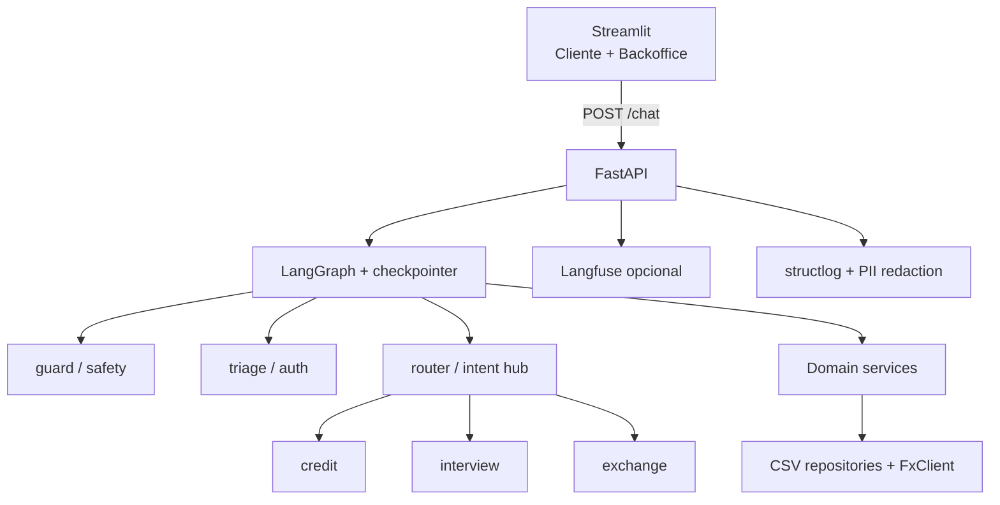

# Banco Ágil — Agente Bancário Inteligente

Sistema de atendimento ao cliente para um banco digital fictício, com agentes de IA especializados (triagem, crédito, entrevista financeira e câmbio), orquestrados por **LangGraph**, expostos via **FastAPI** e testáveis em **Streamlit** (visão cliente + backoffice).

> Desafio técnico — vaga de Especialista.

## Progresso

| Parte | Conteúdo | Status |
|---|---|---|
| 1 | Domain + CSV atômico + ML classifiers | ✅ |
| 2 | LangGraph (guard, triage, router, skills, CLI) | ✅ |
| 3 | FastAPI + Streamlit (Cliente + Backoffice) | ✅ |
| 4 | Langfuse + structlog + Docker + README | ✅ |

---

## Visão Geral

O cliente conversa com **um único assistente**. Internamente, um grafo LangGraph roteia entre nós especializados após autenticação (CPF + data de nascimento). Regras financeiras (score, aprovação de limite, persistência CSV) são **código Python tipado** — o princípio é **"LLM interpreta e redige, código decide"**.

Com LLM configurado:

1. **Intenção** — a LLM é a intérprete primária (com contexto da conversa); o roteador semântico (sklearn) é rede de apoio.
2. **Mensagens** — os nós montam fatos/decisões (`MessageSpec`); o `MessageComposer` redige o texto ao cliente, com guarda de fatos e fallback canônico.
3. **Valores** — a LLM interpreta respostas em linguagem natural (ex.: “sete mil” → 7000); o código valida e aplica as regras.

Toda a lógica determinística (auth, score, limites, câmbio) funciona **sem LLM**. Sem chave/pacote, o sistema degrada para roteamento semântico + heurística — 100% testável sem API paga.

---

## Arquitetura



Camadas: **UI → API → Orquestração → Domínio → Infraestrutura**.

---

## Funcionalidades implementadas

- [x] Triagem com autenticação CPF + data de nascimento  
- [x] Máximo 3 tentativas de autenticação  
- [x] Consulta de limite de crédito  
- [x] Solicitação de aumento com CSV (`pendente` → `aprovado`/`rejeitado`)  
- [x] Validação via `score_limite.csv`  
- [x] Oferta de entrevista após rejeição  
- [x] Entrevista financeira + recálculo de score (0–1000)  
- [x] Atualização de score em `clientes.csv` + reanálise  
- [x] Cotação de câmbio (AwesomeAPI / mock)  
- [x] Encerramento a pedido do usuário  
- [x] Transição implícita (persona única)  
- [x] Filtro de intenções maliciosas (denylist + classifier)  
- [x] Roteamento híbrido (LLM primária + sklearn + clarificação)  
- [x] Composição de respostas via LLM com guarda de fatos  
- [x] UI Streamlit com aba Backoffice  
- [x] Observabilidade (structlog + Langfuse opcional)  
- [x] Docker Compose (extras LLM/observability + volumes graváveis)  

---

## Desafios enfrentados e soluções

| Desafio | Solução |
|---|---|
| Estado multi-turno sem loop infinito | Checkpointer por `thread_id`; skills encerram o **turno** com `END` |
| Aumento de limite com “sim” / valor em turnos separados | Flags `awaiting_increase_confirm` / `awaiting_limit_value` |
| Entrevista multi-turno perdia contexto entre respostas | Flag `awaiting_interview` faz o hub `router` manter o cliente no fluxo até completar os 5 campos |
| Não amarrar a um único provedor de LLM | Camada `llm/` com factory via `init_chat_model` (Gemini/Groq/OpenAI/Together/OpenRouter) — troca por `.env` |
| LLM indisponível não pode derrubar o atendimento | `build_chat_model` degrada para `None`; composer/extractor/intent falham com fallback canônico/heurístico |
| CSV concorrente e corrupção | `filelock` + escrita atômica (`temp` + `os.replace`) |
| Prompt injection | Defesa em profundidade: guard ML/regex + least privilege nas tools |
| Observabilidade sem acoplamento | Langfuse opcional; app segue se chaves/SDK ausentes |
| Transição entre agentes | Hub `router` + persona unificada (sem mencionar “transferência”) |
| Bind mounts no Docker com usuário não-root | `APP_UID`/`APP_GID` alinhados ao host + entrypoint que valida escrita em `/app/data` |

---

## Escolhas técnicas e justificativas

| Decisão | Alternativa | Por quê |
|---|---|---|
| **LangGraph** | CrewAI | State machine explícita, retry de auth, handoff implícito, traces claros |
| `init_chat_model` (LangChain) | SDK por provedor | Interface única; troca de provedor sem tocar no código |
| FastAPI + Streamlit | Streamlit monolítico | Separação UI/motor, OpenAPI, concorrência |
| CSV + Repository | PostgreSQL | Escopo do desafio; interface permite trocar depois |
| TF-IDF + LogisticRegression (treino offline) | Só embeddings de API | Zero custo/rede no CI; troca do artefato sem tocar no código |
| Safety classifier + denylist | Confiar só no prompt | Heurística probabilística **não é garantia**; least privilege é a proteção real |
| AwesomeAPI / `FX_MOCK` | Tavily/SerpAPI | Gratuita e simples; mock para demos offline |
| SqliteSaver | MemorySaver em prod | Persiste sessão entre restarts |
| Langfuse SDK v4 (OpenTelemetry) | SDK v2 legado | API atual; sessions nativas + traces por turno |

---

## LLM provider-agnostic

A escolha do provedor é uma mudança de **configuração**, não de código. A camada `src/banco_agil/llm/` centraliza:

| Módulo | Papel |
|---|---|
| `factory.build_chat_model` | Instancia o chat model (ou `None`) |
| `intent.LlmIntentClassifier` | Classifica intenção (`credit` / `exchange` / `interview` / `end`) |
| `extract.LlmExtractor` | Interpreta valores em linguagem natural (dinheiro, emprego, etc.) |
| `composer.MessageComposer` | Redige a mensagem ao cliente a partir de fatos do código |

| `LLM_PROVIDER` | Extra a instalar | Chave no `.env` |
|---|---|---|
| `gemini` (Google AI Studio) | `pip install -e ".[llm-gemini]"` | `GEMINI_API_KEY` |
| `groq` | `pip install -e ".[llm-groq]"` | `GROQ_API_KEY` |
| `openai` | `pip install -e ".[llm-openai]"` | `OPENAI_API_KEY` |
| `together` | `pip install -e ".[llm-together]"` | `TOGETHER_API_KEY` |
| `openrouter` | `pip install -e ".[llm-openai]"` | `OPENROUTER_API_KEY` (+ `OPENROUTER_BASE_URL`) |
| `none` / `fake` | — | — (roteamento heurístico) |

Defina também `LLM_MODEL` (ex.: `gemini-flash-latest`, `gemini-3.6-flash`, `llama-3.1-8b-instant`, `gpt-4o-mini`). Sem chave ou pacote, a app **não quebra**.

---

## Tutorial de execução e testes

### 1. Setup local

```bash
python -m venv .venv
source .venv/bin/activate
pip install -e ".[dev]"
# LLM do provedor desejado (ex.: Gemini / Google AI Studio)
pip install -e ".[llm-gemini]"
# opcional: Langfuse
pip install -e ".[observability]"

cp .env.example .env
# preencher a chave do provedor (ex.: GEMINI_API_KEY)
# FX_MOCK=true funciona sem rede; LLM_PROVIDER=none desliga o LLM

python scripts/seed_data.py
python scripts/train_router.py
python scripts/train_safety.py
```

### 2. Qualidade

```bash
ruff check . && ruff format --check .
pyright
pytest tests/unit tests/integration -v
```

### 3. CLI (sem UI)

```bash
python -m banco_agil.cli
# Ana: 529.982.247-25 / 15/05/1990
```

### 4. API + Streamlit (local)

```bash
# terminal 1
uvicorn banco_agil.main:app --reload --port 8000

# terminal 2
streamlit run src/banco_agil/ui/streamlit_app.py
```

- OpenAPI: http://localhost:8000/docs  
- UI: http://localhost:8501  

> Não rode local e Docker ao mesmo tempo na mesma porta (`8000` / `8501`).

### 5. Langfuse (observabilidade opcional)

Sem chaves ou sem o pacote, a API sobe normalmente (tracer no-op). Com as duas coisas configuradas, cada turno gera um trace `turn:<agente>` agrupado por `session_id` (aba **Sessions** no Langfuse). CPF e datas são redigidos antes do envio.

**Passo a passo**

1. Crie conta / projeto em [Langfuse Cloud](https://cloud.langfuse.com) (ou use self-hosted).
2. No projeto: **Settings → API Keys** → crie um par (public + secret).
3. Instale o extra (local) ou inclua `observability` no `DOCKER_EXTRAS` (Docker — já é o default):

   ```bash
   pip install -e ".[observability]"
   ```

4. No `.env`:

   ```bash
   LANGFUSE_PUBLIC_KEY=pk-lf-...
   LANGFUSE_SECRET_KEY=sk-lf-...
   # Região do projeto (este app usa LANGFUSE_HOST, não LANGFUSE_BASE_URL):
   LANGFUSE_HOST=https://cloud.langfuse.com          # EU (default)
   # LANGFUSE_HOST=https://us.cloud.langfuse.com     # US
   # LANGFUSE_HOST=https://jp.cloud.langfuse.com     # JP
   # LANGFUSE_HOST=https://seu-host.example.com      # self-hosted
   ```

5. Suba a API (local ou Docker) e envie uma mensagem pelo chat.
6. Confirme nos logs de startup: `langfuse_enabled` (e `host=...`). Se faltar chave/pacote: `langfuse_disabled`.
7. No Streamlit → aba **Backoffice** → seção **Langfuse**: link do trace do último turno (quando habilitado).
8. No painel Langfuse: **Sessions** (conversa) e **Tracing** (turnos `turn:triage`, `turn:credit`, etc.).

### 6. Docker Compose

A imagem instala extras pip via build-arg `DOCKER_EXTRAS` (default: `llm-gemini,observability`).  
`FX_MOCK`, chaves de LLM e Langfuse vêm do `.env` (nada disso é forçado no compose).  
O usuário do container usa `APP_UID`/`APP_GID` (default `1000`) para gravar em `./data` e `./models`.

**Pré-requisitos no host**

```bash
cp .env.example .env
# preencher GEMINI_API_KEY (ou outro provedor) e, se quiser, LANGFUSE_*
# se seu UID não for 1000:
echo "APP_UID=$(id -u)" >> .env
echo "APP_GID=$(id -g)" >> .env

python scripts/seed_data.py
python scripts/train_router.py
python scripts/train_safety.py
```

**Subir**

```bash
docker compose up --build
```

- API: http://localhost:8000/health  
- UI: http://localhost:8501  
- OpenAPI: http://localhost:8000/docs  

A UI só sobe após o healthcheck da API (`service_healthy`).

**Trocar provedor na imagem** (exige rebuild):

```bash
# exemplo OpenAI
DOCKER_EXTRAS=llm-openai,observability docker compose build --no-cache
# no .env: LLM_PROVIDER=openai, LLM_MODEL=gpt-4o-mini, OPENAI_API_KEY=...
docker compose up -d
```

**Operação útil**

```bash
docker compose logs -f api          # ver llm_ready / langfuse_enabled
docker compose down                 # para os serviços
docker compose down -v              # para (não apaga ./data nem ./models — são bind mounts)
```

Se o entrypoint falhar com “não é gravável”, alinhe `APP_UID`/`APP_GID` ao `id -u` / `id -g` do host e faça rebuild.

### 7. Roteiro de demo (5 min)

1. **Cliente:** login (Ana: `529.982.247-25` / `15/05/1990`) → consultar limite → `sim` → informar valor (ex.: 6000 → rejeição)  
2. Aceitar entrevista → preencher renda / emprego / despesas / dependentes / dívidas → reanálise  
3. Cotação do dólar → encerrar  
4. **Backoffice:** agente ativo, route/confidence, safety, tools, score JSON, preview do CSV  
5. **Langfuse (se configurado):** link do trace no Backoffice + Sessions no painel Langfuse  

---

## Schema dos dados

**clientes.csv:** `cpf`, `data_nascimento`, `nome`, `limite_atual`, `score`  

**score_limite.csv:** `score_min`, `score_max`, `limite_max_permitido`  

**solicitacoes_aumento_limite.csv:** `request_id`, `cpf_cliente`, `data_hora_solicitacao`, `limite_atual`, `novo_limite_solicitado`, `status_pedido`

---

## Variáveis de ambiente

Ver [`.env.example`](.env.example). Destaques:

| Var | Uso |
|---|---|
| `LLM_PROVIDER` | `gemini` \| `groq` \| `openai` \| `together` \| `openrouter` \| `none` |
| `LLM_MODEL` | Nome do modelo no provedor (ex.: `gemini-3.6-flash`) |
| `LLM_TEMPERATURE` | Amostragem (0 = determinístico; alguns modelos Gemini de sampling fixo ignoram) |
| `GEMINI_API_KEY` / `GROQ_API_KEY` / … | Chave do provedor escolhido |
| `FX_MOCK` | `true` = cotação fixa sem rede; `false` = AwesomeAPI |
| `FX_API_URL` | Template com `{pair}` (default AwesomeAPI) |
| `SAFETY_ENABLED` / `SAFETY_THRESHOLD` | Nó guard + limiar do classifier |
| `ROUTER_CONFIDENCE_THRESHOLD` | Limiar do roteador semântico sklearn |
| `LANGFUSE_PUBLIC_KEY` / `LANGFUSE_SECRET_KEY` | Tracing (opcional; ambos obrigatórios para habilitar) |
| `LANGFUSE_HOST` | Host da região (`https://cloud.langfuse.com` EU, `https://us.cloud.langfuse.com` US, …) |
| `API_BASE_URL` | Base usada pelo Streamlit (`http://localhost:8000` local; no Compose a UI usa `http://api:8000`) |
| `DATA_DIR` / `MODELS_DIR` / `CHECKPOINTER_DB` | Paths locais (no Docker o compose sobrescreve para `/app/...`) |
| `DOCKER_EXTRAS` | Extras pip no build da imagem (ex.: `llm-gemini,observability`) |
| `APP_UID` / `APP_GID` | UID/GID do usuário no container (alinhar ao host para volumes) |

---

## Roadmap

- `PostgresSaver` / repositórios PostgreSQL  
- Eval contínuo de intents/safety com dados reais  
- Rate limiting e autenticação da API  

---

## Licença / entrega

Repositório para avaliação do desafio técnico. Código organizado sob `src/banco_agil/` com tipagem estática (Pyright) e lint (Ruff).
