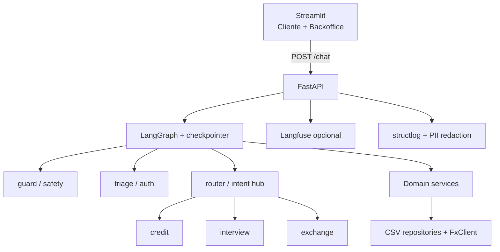

# Banco Ágil — Agente Bancário Inteligente

Sistema de atendimento ao cliente para um banco digital fictício, com agentes de IA especializados (triagem, crédito, entrevista financeira e câmbio), orquestrados por **LangGraph**, expostos via **FastAPI** e testáveis em **Streamlit** (visão cliente + backoffice).

> Desafio técnico — vaga de Especialista.  
> Plano de execução: [`PROMPT-IMPLEMENTACAO.md`](PROMPT-IMPLEMENTACAO.md) · Arquitetura: [`docs/ESTRATEGIA-IMPLEMENTACAO.md`](docs/ESTRATEGIA-IMPLEMENTACAO.md)

## Progresso

| Parte | Conteúdo | Status |
|---|---|---|
| 1 | Domain + CSV atômico + ML classifiers | ✅ |
| 2 | LangGraph (guard, triage, router, skills, CLI) | ✅ |
| 3 | FastAPI + Streamlit (Cliente + Backoffice) | ✅ |
| 4 | Langfuse + structlog + Docker + README | ✅ |

---

## Visão Geral

O cliente conversa com **um único assistente**. Internamente, um grafo LangGraph roteia entre nós especializados após autenticação (CPF + data de nascimento). Regras financeiras (score, aprovação de limite, persistência CSV) são **código Python tipado** — o LLM (quando houver) só formata linguagem; nesta entrega o fluxo conversacional é determinístico e testável sem API paga.

---

## Arquitetura



Camadas: **UI → API → Orquestração → Domínio → Infraestrutura**. Fluxogramas por unidade: [`docs/fluxogramas/`](docs/fluxogramas/).

---

## Funcionalidades implementadas

- [x] Triagem com autenticação CPF + data de nascimento  
- [x] Máximo 3 tentativas de autenticação  
- [x] Consulta de limite de crédito  
- [x] Solicitação de aumento com CSV (`pendente` → `aprovado`/`rejeitado`)  
- [x] Validação via `score_limite.csv`  
- [x] Oferta de entrevista após rejeição  
- [x] Entrevista financeira + recálculo de score (0–1000)  
- [x] Atualização de score em `clientes.csv` + reanálise  
- [x] Cotação de câmbio (AwesomeAPI / mock)  
- [x] Encerramento a pedido do usuário  
- [x] Transição implícita (persona única)  
- [x] Filtro de intenções maliciosas (denylist + classifier)  
- [x] Roteamento semântico híbrido (sklearn + fallback)  
- [x] UI Streamlit com aba Backoffice  
- [x] Observabilidade (structlog + Langfuse opcional)  
- [x] Docker Compose  

---

## Desafios enfrentados e soluções

| Desafio | Solução |
|---|---|
| Estado multi-turno sem loop infinito | Checkpointer por `thread_id`; skills encerram o **turno** com `END` |
| Aumento de limite com “sim” / valor em turnos separados | Flags `awaiting_increase_confirm` / `awaiting_limit_value` |
| CSV concorrente e corrupção | `filelock` + escrita atômica (`temp` + `os.replace`) |
| Prompt injection | Defesa em profundidade: guard ML/regex + least privilege nas tools |
| Observabilidade sem acoplamento | Langfuse opcional; app segue se chaves/SDK ausentes |
| Transição entre agentes | Hub `router` + persona unificada (sem mencionar “transferência”) |

---

## Escolhas técnicas e justificativas

| Decisão | Alternativa | Por quê |
|---|---|---|
| **LangGraph** | CrewAI | State machine explícita, retry de auth, handoff implícito, traces claros |
| FastAPI + Streamlit | Streamlit monolítico | Separação UI/motor, OpenAPI, concorrência |
| CSV + Repository | PostgreSQL | Escopo do desafio; interface permite trocar depois |
| TF-IDF + LogisticRegression (treino offline) | Só embeddings de API | Zero custo/rede no CI; upgrade via `EmbeddingsProvider` |
| Safety classifier + denylist | Confiar só no prompt | Heurística probabilística **não é garantia**; least privilege é a proteção real |
| AwesomeAPI / `FX_MOCK` | Tavily/SerpAPI | Gratuita e simples; mock para demos offline |
| SqliteSaver | MemorySaver em prod | Persiste sessão entre restarts |

---

## Tutorial de execução e testes

### 1. Setup local

```bash
python -m venv .venv
source .venv/bin/activate
pip install -e ".[dev]"
# opcional: Langfuse
pip install -e ".[observability]"

cp .env.example .env
# preencher GROQ/LANGFUSE se desejar; FX_MOCK=true funciona sem rede

python scripts/seed_data.py
python scripts/train_router.py
python scripts/train_safety.py
```

### 2. Qualidade

```bash
ruff check . && ruff format --check .
pyright
pytest tests/unit tests/integration -v
```

### 3. CLI (sem UI)

```bash
python -m banco_agil.cli
# Ana: 529.982.247-25 / 15/05/1990
```

### 4. API + Streamlit

```bash
# terminal 1
uvicorn banco_agil.main:app --reload --port 8000

# terminal 2
streamlit run src/banco_agil/ui/streamlit_app.py
```

- OpenAPI: http://localhost:8000/docs  
- UI: http://localhost:8501  

### 5. Docker Compose

```bash
cp .env.example .env   # se ainda não existir
python scripts/seed_data.py && python scripts/train_router.py && python scripts/train_safety.py
docker compose up --build
```

- API: http://localhost:8000/health  
- UI: http://localhost:8501  

A UI só sobe após o healthcheck da API (`service_healthy`).

### 6. Roteiro de demo (5 min)

1. **Cliente:** login → consultar limite → `sim` → informar valor (ex.: 6000 para Ana → rejeição)  
2. Aceitar entrevista → preencher renda / emprego / despesas / dependentes / dívidas → reanálise  
3. Cotação do dólar → encerrar  
4. **Backoffice:** agente ativo, route/confidence, safety, tools, score JSON, preview do CSV  
5. (Opcional) Abrir link Langfuse se `LANGFUSE_*` estiverem configuradas  

---

## Schema dos dados

**clientes.csv:** `cpf`, `data_nascimento`, `nome`, `limite_atual`, `score`  

**score_limite.csv:** `score_min`, `score_max`, `limite_max_permitido`  

**solicitacoes_aumento_limite.csv:** `request_id`, `cpf_cliente`, `data_hora_solicitacao`, `limite_atual`, `novo_limite_solicitado`, `status_pedido`

---

## Variáveis de ambiente

Ver [`.env.example`](.env.example). Destaques:

| Var | Uso |
|---|---|
| `FX_MOCK` | Cotação fixa sem rede |
| `SAFETY_ENABLED` | Liga/desliga nó guard |
| `LANGFUSE_PUBLIC_KEY` / `SECRET` | Tracing (opcional) |
| `API_BASE_URL` | Base usada pelo Streamlit |

---

## Roadmap

- `PostgresSaver` / repositórios PostgreSQL  
- Eval contínuo de intents/safety com dados reais  
- Rate limiting e autenticação da API  
- Screenshots Langfuse/Backoffice na pasta `docs/assets/`  

---

## Licença / entrega

Repositório para avaliação do desafio técnico. Código organizado sob `src/banco_agil/` com tipagem estática (Pyright) e lint (Ruff).
