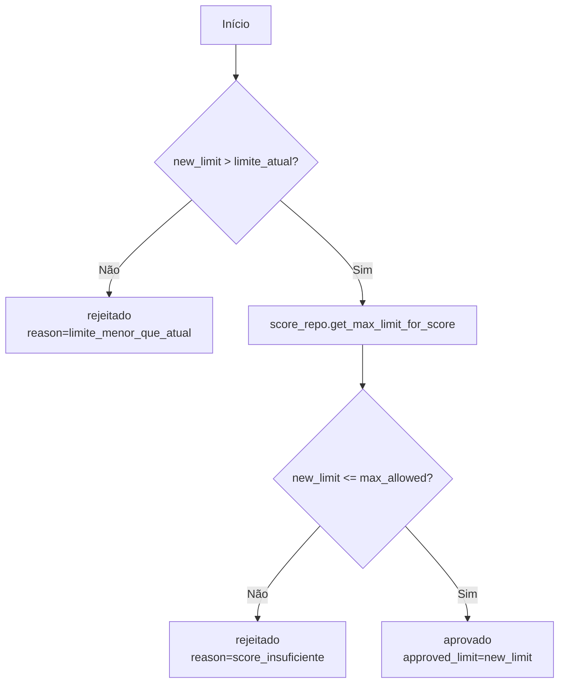

# Fluxogramas — Banco Ágil

Esta pasta documenta **como cada unidade não-trivial funciona**, em complemento às docstrings do código. É parte do padrão de documentação obrigatório definido em [`../../PROMPT-IMPLEMENTACAO.md`](../../PROMPT-IMPLEMENTACAO.md).

## Convenção

- **Um arquivo por Parte:** `parte-1-fundacao.md`, `parte-2-orquestracao.md`, `parte-3-api-ui.md`, `parte-4-observabilidade.md`.
- **Um diagrama por unidade**, com título = **nome qualificado** (`modulo.Classe.metodo` ou `modulo.funcao`).
- **Sintaxe:** Mermaid (`flowchart` na maioria; `sequenceDiagram` para interações entre camadas).
- **Escopo:** gerar fluxograma apenas para unidades com lógica não-trivial (nós, edges, services com ramificação, repositories atômicos, classifiers, ciclo de crédito). DTOs, getters e funções triviais ficam só com docstring.

## Legenda de status

| Marcador | Significado |
|---|---|
| ✅ | Diagrama validado contra o código implementado |
| 🟡 | Rascunho derivado da estratégia; revisar ao implementar |
| 🔲 | Pendente (a preencher durante a implementação) |

> **Regra de sincronização:** ao implementar/alterar uma unidade, atualize o diagrama correspondente **no mesmo commit**. Um diagrama 🟡 deve virar ✅ quando o código existir e conferir.

## Exemplo de referência (padrão de qualidade esperado)

### `domain.credit_limit.CreditLimitService.evaluate_request` — 🟡

