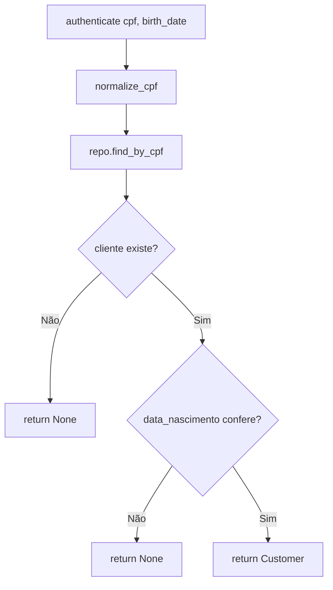
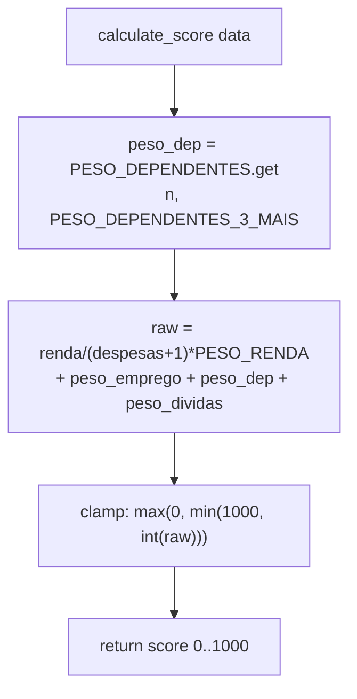
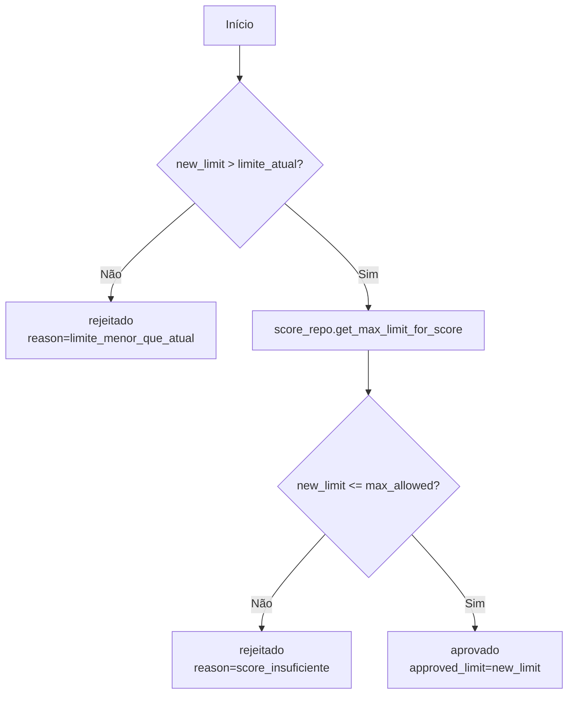
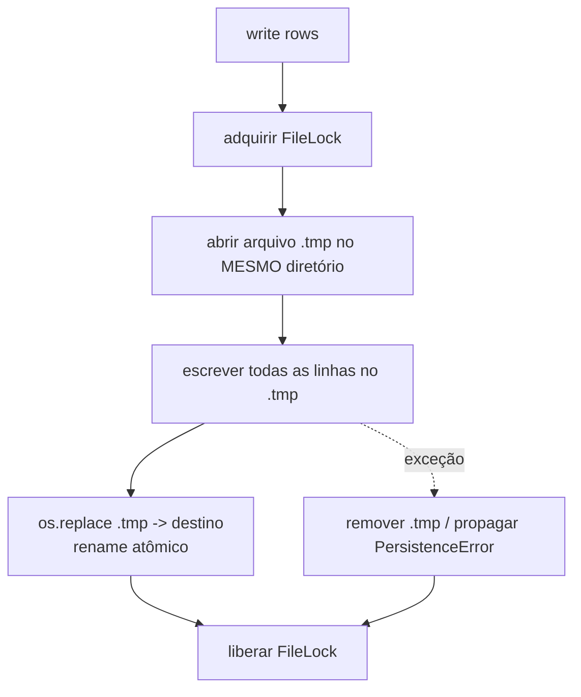
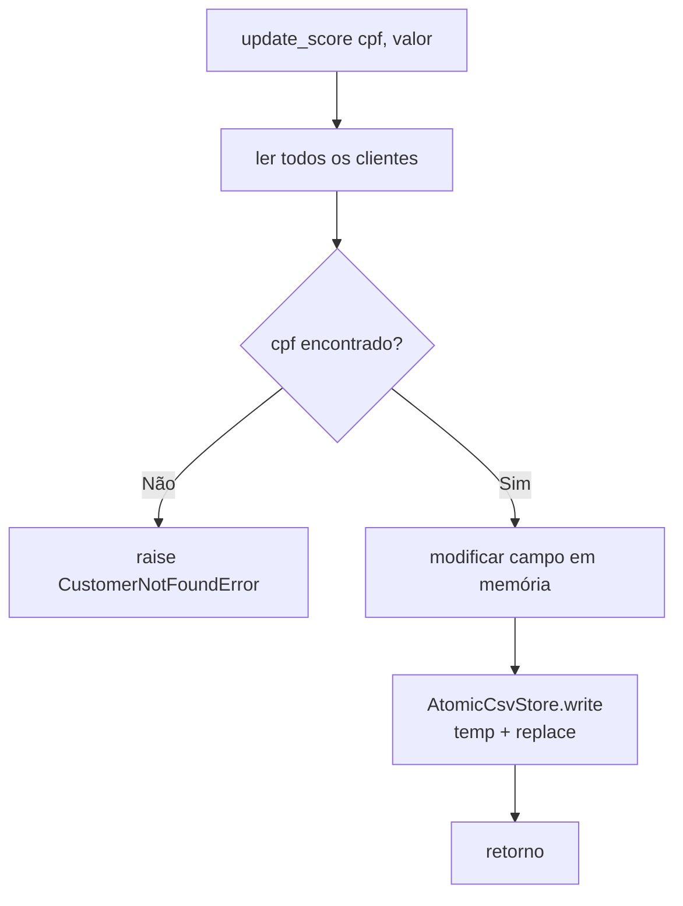
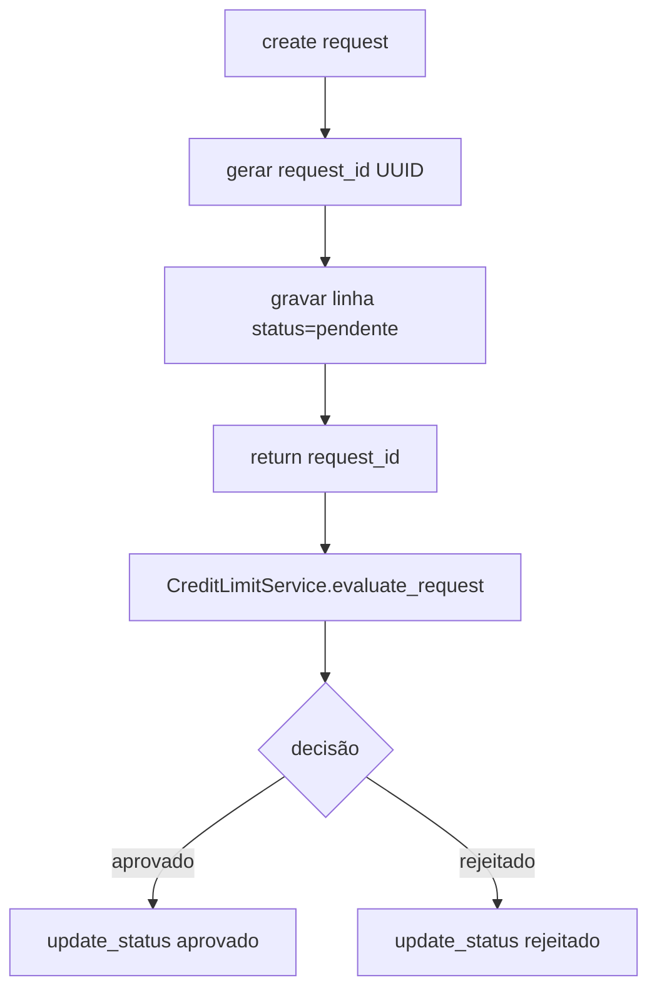
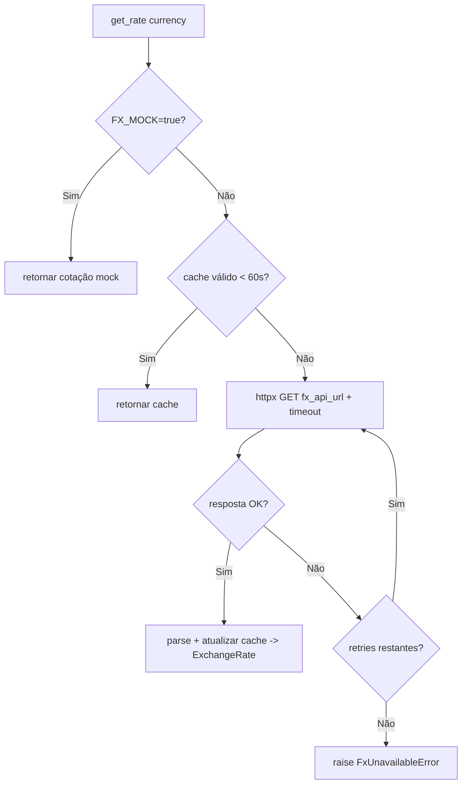
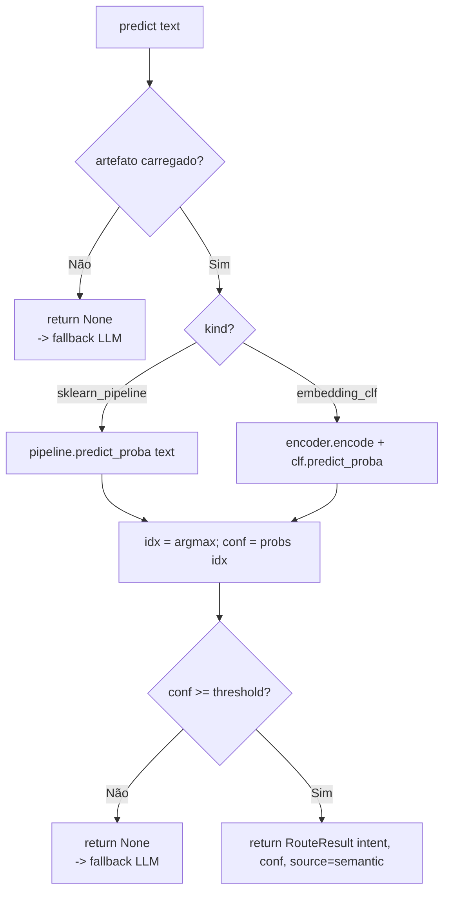
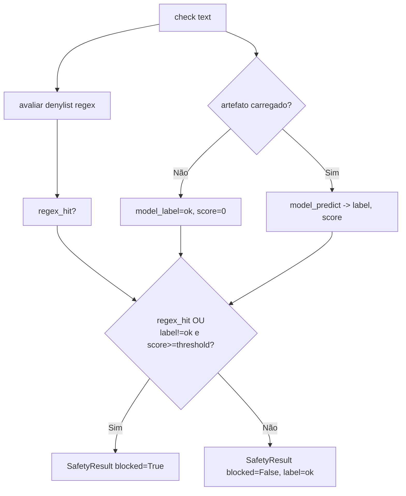

# Parte 1 — Fluxogramas: Fundação (Domain + Infra + ML)

> Status: 🟡 = rascunho da estratégia · ✅ = validado no código · 🔲 = pendente.
> Referência de escopo: [`../../PROMPT-IMPLEMENTACAO.md`](../../PROMPT-IMPLEMENTACAO.md) (Parte 1).
>
> **Parte 1 implementada e validada** (`ruff` / `pyright` / `pytest` verdes).

---

## Domínio

### `domain.auth.AuthService.authenticate` — ✅

### `domain.scoring.ScoringService.calculate_score` — ✅

### `domain.credit_limit.CreditLimitService.evaluate_request` — ✅

---

## Infraestrutura

### `infrastructure.csv_repository.AtomicCsvStore.write_all` — ✅

### `infrastructure.customer_repository.CsvCustomerRepository.update_score` / `update_limit` — ✅

### `infrastructure.credit_request_repository` — ciclo de vida — ✅

### `infrastructure.fx_client.FxClient.get_rate` — ✅

---

## Machine Learning

### `ml.intent_router.SemanticIntentRouter.predict` — ✅

### `ml.safety_classifier.SafetyClassifier.check` — ✅

