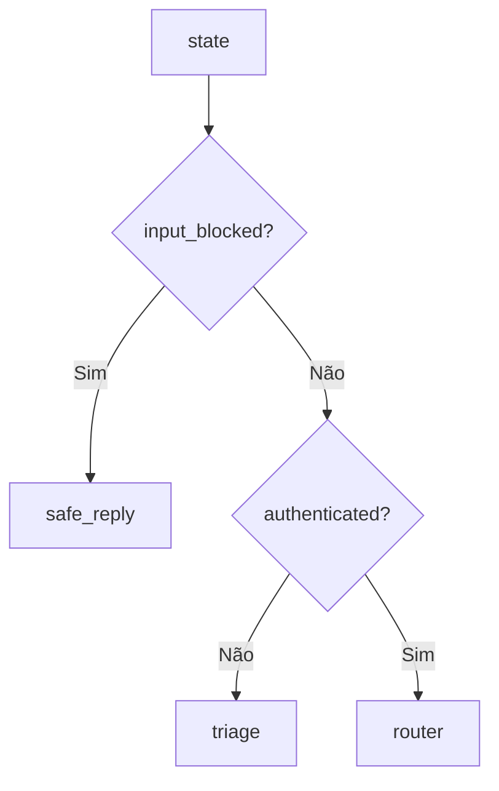
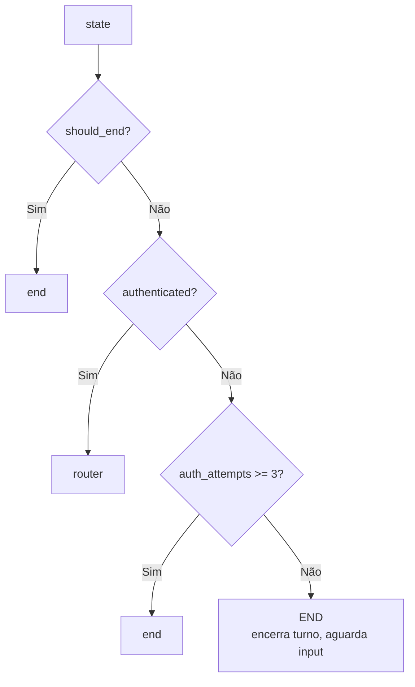
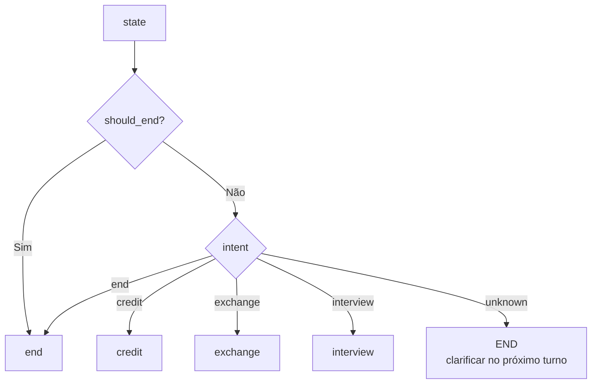
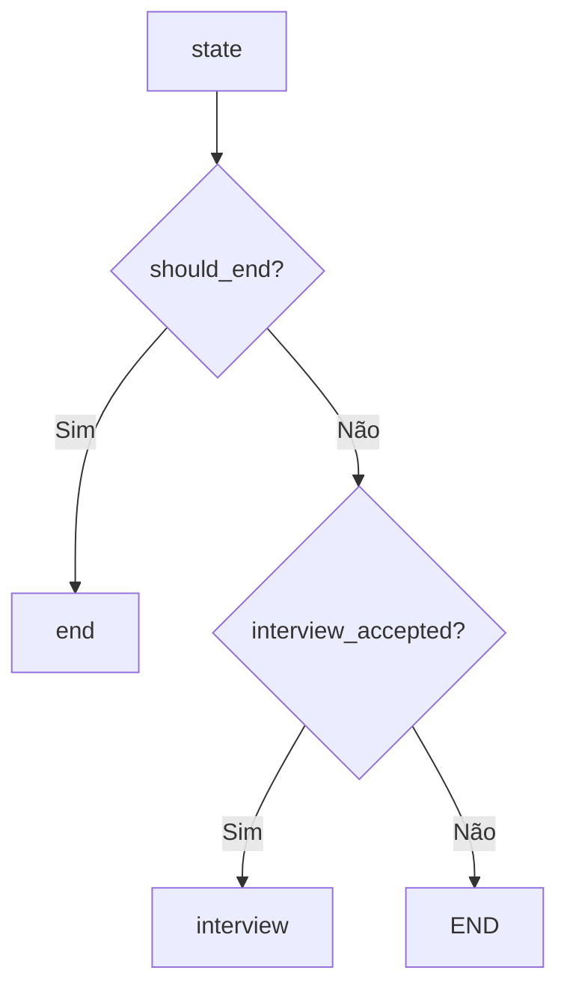
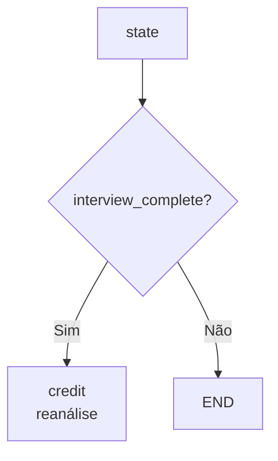
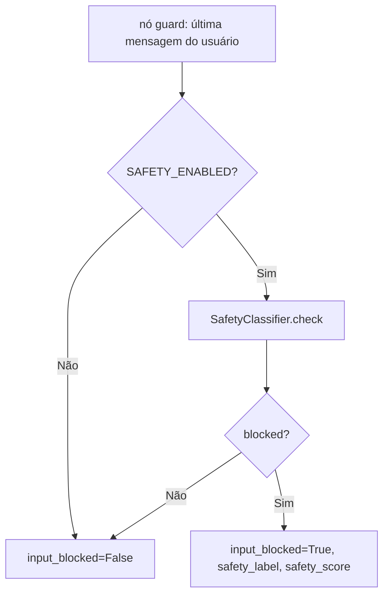
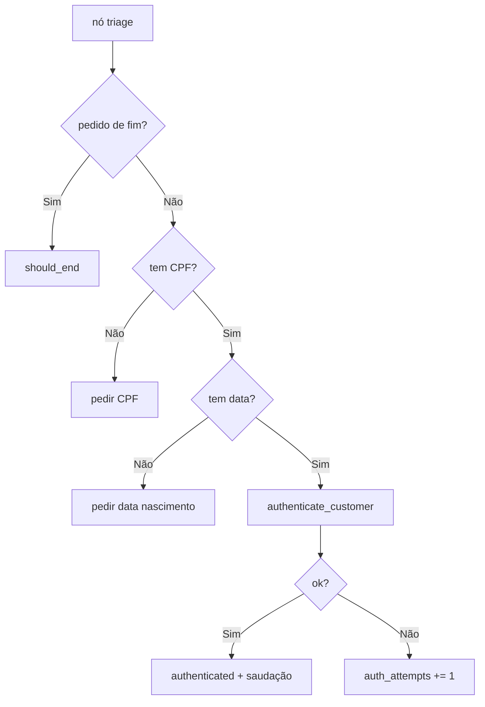
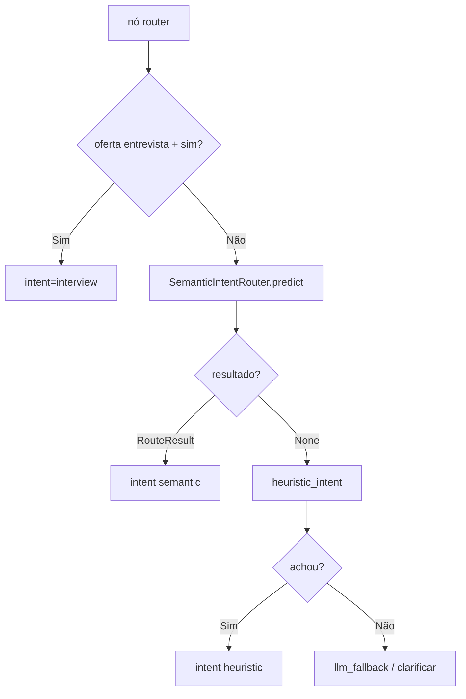
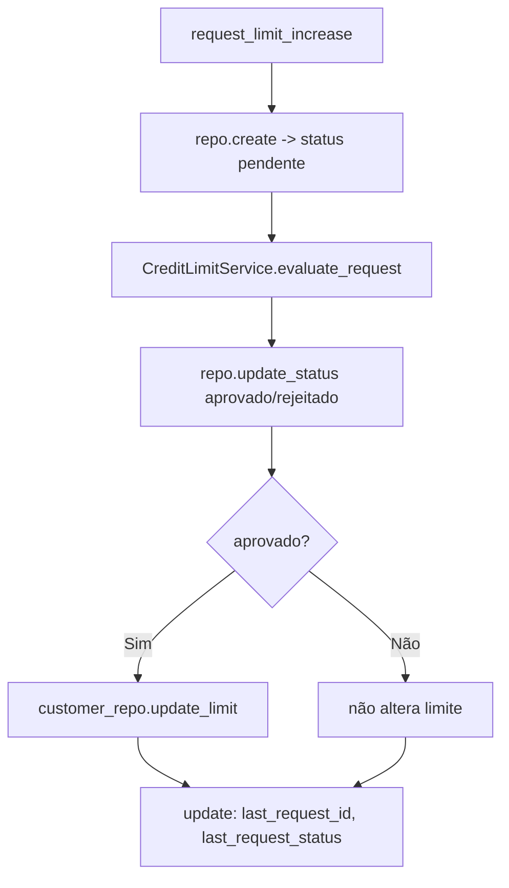

# Parte 2 — Fluxogramas: Orquestração (LangGraph)

> Status: 🟡 = rascunho da estratégia · ✅ = validado no código · 🔲 = pendente.
> Referência de escopo: [`../../PROMPT-IMPLEMENTACAO.md`](../../PROMPT-IMPLEMENTACAO.md) (Parte 2).
>
> **Parte 2 implementada e validada** (`test_routing` + `test_graph_flow` verdes).

---

## Topologia geral

### `graph.workflow.build_graph` — ✅

```mermaid
flowchart TD
    START((START)) --> guard
    guard --> rg{route_after_guard}
    rg -- input_blocked --> safe_reply --> END((END))
    rg -- não autenticado --> triage
    rg -- autenticado --> router
    triage --> rt{route_after_triage}
    rt -- 3 falhas --> end
    rt -- turno aguarda input --> END
    rt -- autenticado --> router
    router --> rr{route_after_router}
    rr -- credit --> credit
    rr -- exchange --> exchange
    rr -- interview --> interview
    rr -- end --> end
    rr -- incerto --> END
    credit --> rc{route_after_credit}
    rc -- interview_accepted --> interview
    rc -- senão --> END
    interview --> ri{route_after_interview}
    ri -- complete --> credit
    ri -- incompleta --> END
    exchange --> END
    end --> END
```

> **Nota:** skills encerram o **turno** com `END`. O hub (`router`) é retomado no próximo `invoke` (`guard → router`), evitando loop no mesmo tick.

---

## Funções de roteamento (edges — puras)

### `graph.edges.route_after_guard` — ✅



### `graph.edges.route_after_triage` — ✅



### `graph.edges.route_after_router` — ✅



### `graph.edges.route_after_credit` — ✅



### `graph.edges.route_after_interview` — ✅



---

## Nós com ramificação

### `graph.nodes.guard` — ✅



### `graph.nodes.triage` — ✅



### `graph.nodes.router` — ✅



---

## Tools

### `tools.credit_tools.request_limit_increase_update` — ✅


