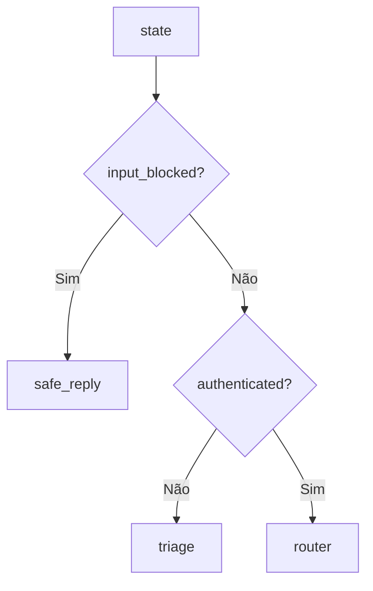
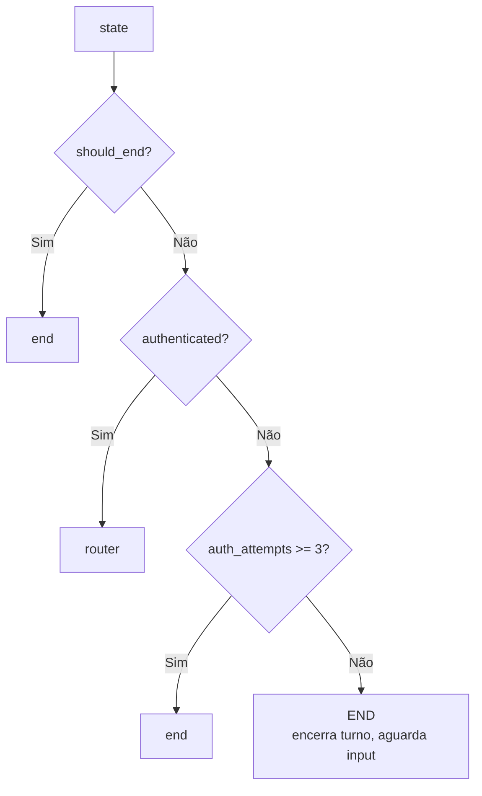
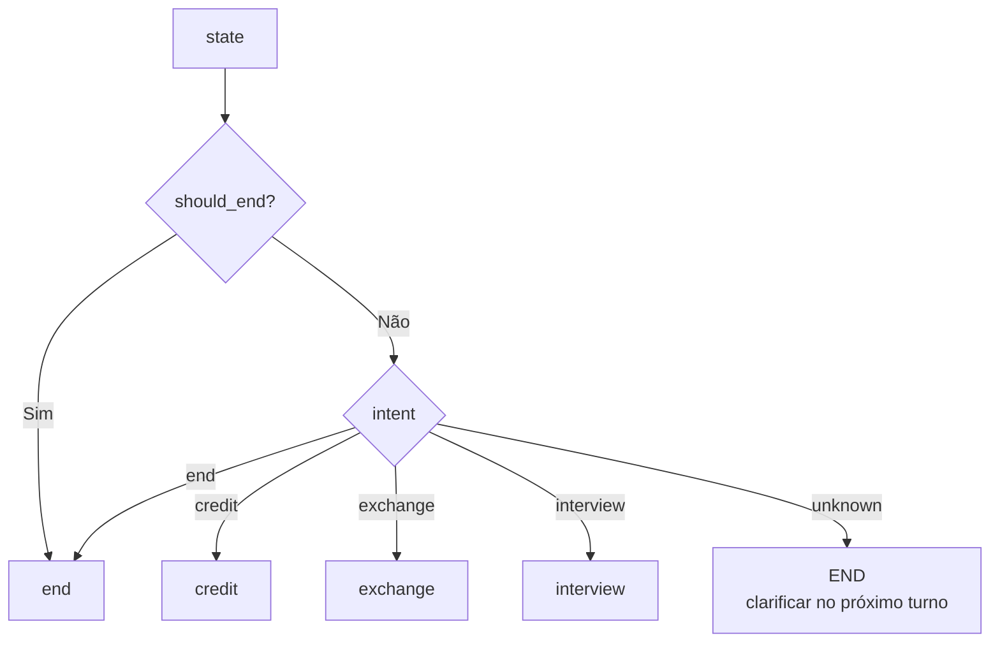
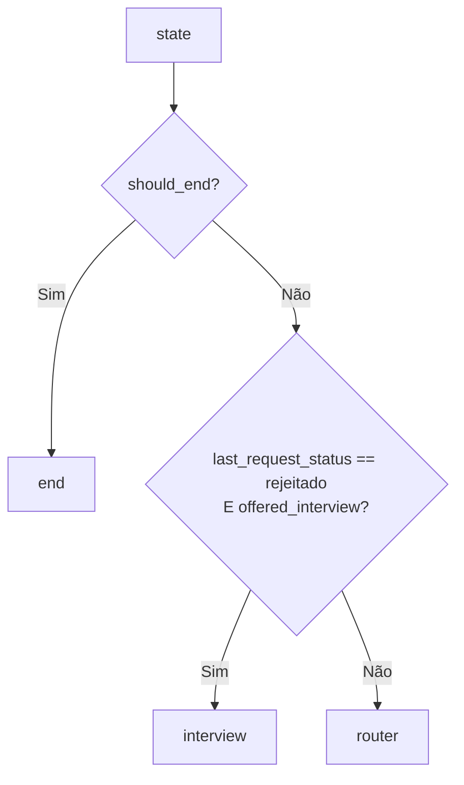
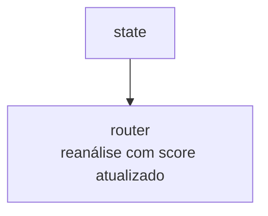
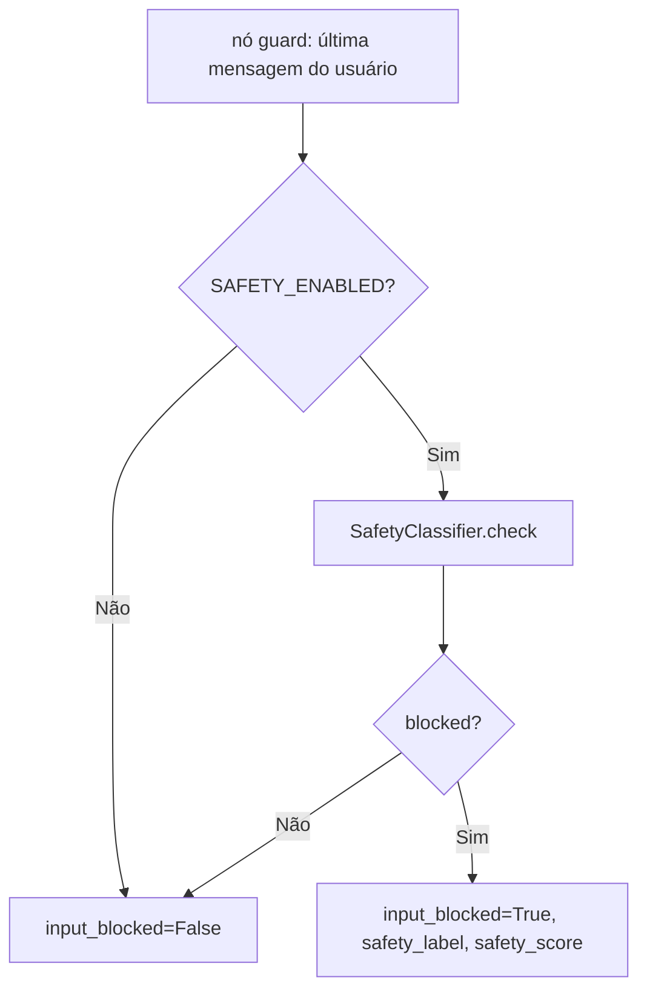
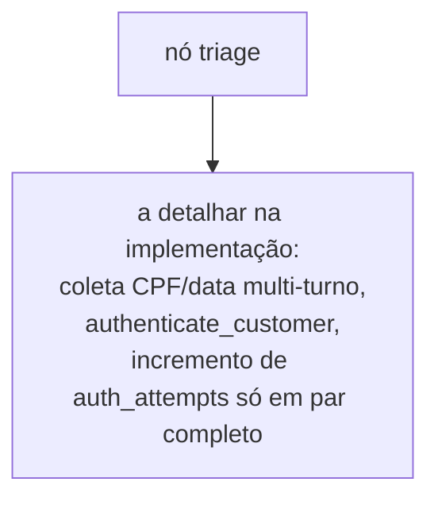
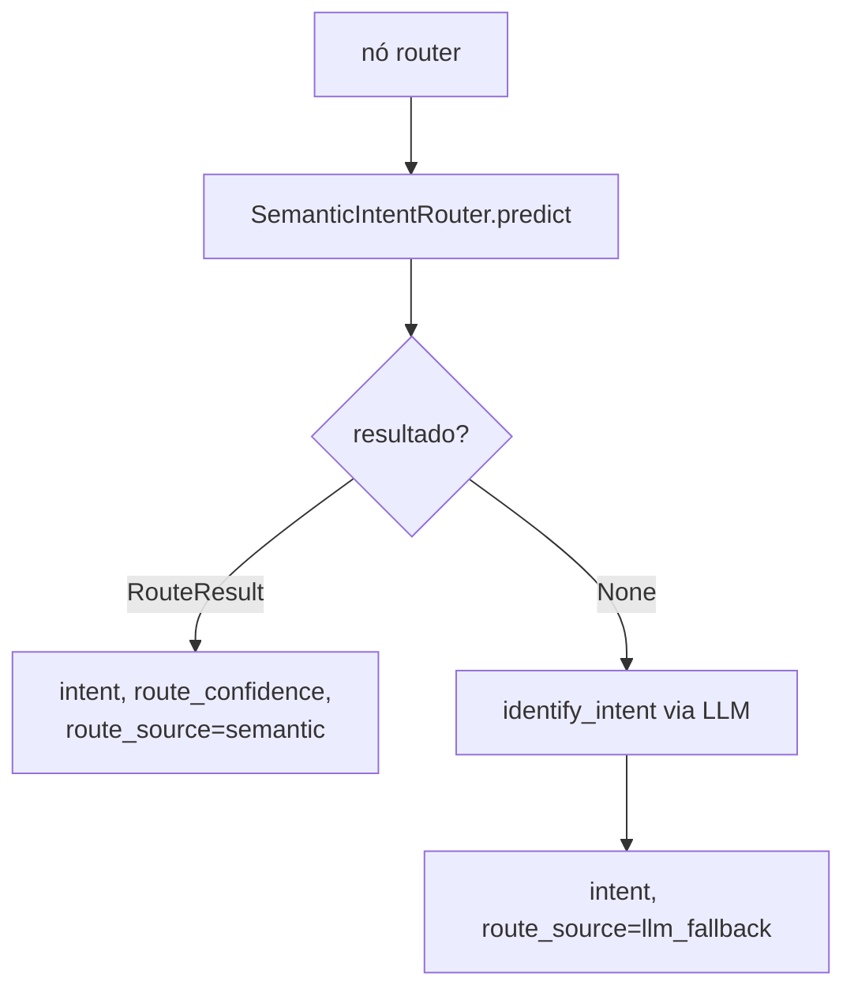
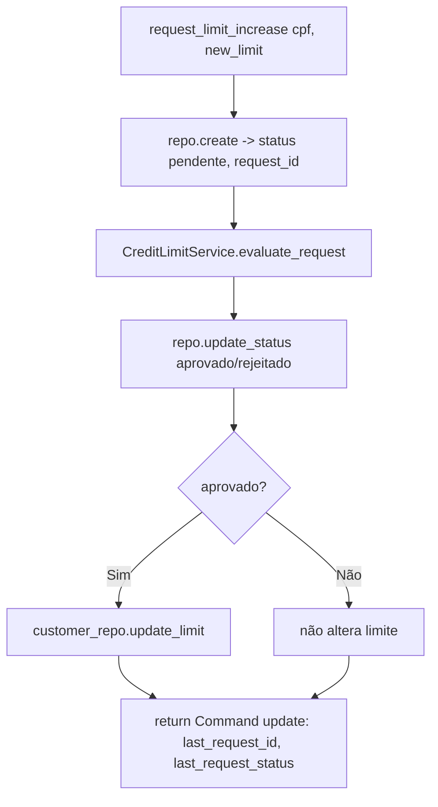

# Parte 2 — Fluxogramas: Orquestração (LangGraph)

> Status: 🟡 = rascunho da estratégia · ✅ = validado no código · 🔲 = pendente.
> Referência de escopo: [`../../PROMPT-IMPLEMENTACAO.md`](../../PROMPT-IMPLEMENTACAO.md) (Parte 2).

---

## Topologia geral

### `graph.workflow.build_graph` — 🟡

```mermaid
flowchart TD
    START((START)) --> guard
    guard --> rg{route_after_guard}
    rg -- input_blocked --> safe_reply --> END((END))
    rg -- não autenticado --> triage
    rg -- autenticado --> router
    triage --> rt{route_after_triage}
    rt -- 3 falhas --> end
    rt -- turno aguarda input --> END
    rt -- autenticado --> router
    router --> rr{route_after_router}
    rr -- credit --> credit
    rr -- exchange --> exchange
    rr -- interview --> interview
    rr -- end --> end
    rr -- incerto --> END
    credit --> rc{route_after_credit}
    rc -- rejeitado + aceite --> interview
    rc -- senão --> router
    interview --> router
    exchange --> router
    end --> END
```

---

## Funções de roteamento (edges — puras)

### `graph.edges.route_after_guard` — 🟡



### `graph.edges.route_after_triage` — 🟡



### `graph.edges.route_after_router` — 🟡



### `graph.edges.route_after_credit` — 🟡



### `graph.edges.route_after_interview` — 🟡



---

## Nós com ramificação

### `graph.nodes.guard` — 🟡



### `graph.nodes.triage` — 🔲



### `graph.nodes.router` — 🟡



---

## Tools

### `tools.credit_tools.request_limit_increase` — 🟡


