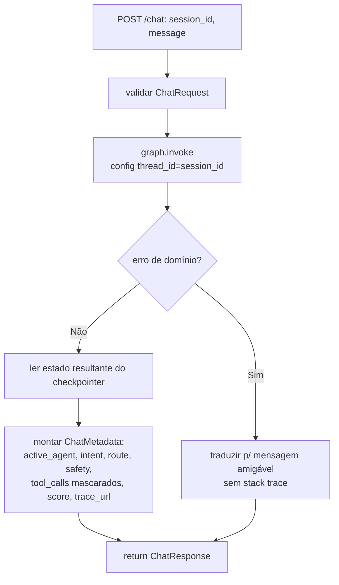
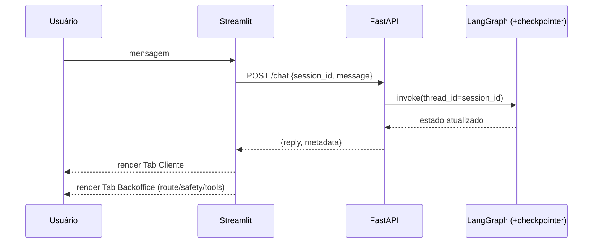
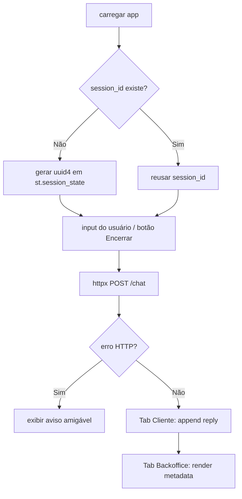

# Parte 3 — Fluxogramas: API + Interface

> Status: 🟡 = rascunho da estratégia · ✅ = validado no código · 🔲 = pendente.
> Referência de escopo: [`../../PROMPT-IMPLEMENTACAO.md`](../../PROMPT-IMPLEMENTACAO.md) (Parte 3).

---

## API

### `api.routes.chat.post_chat` (`POST /chat`) — 🟡

### Interação end-to-end (camadas) — 🟡

---

## UI

### `ui.streamlit_app` — ciclo de interação — 🟡

