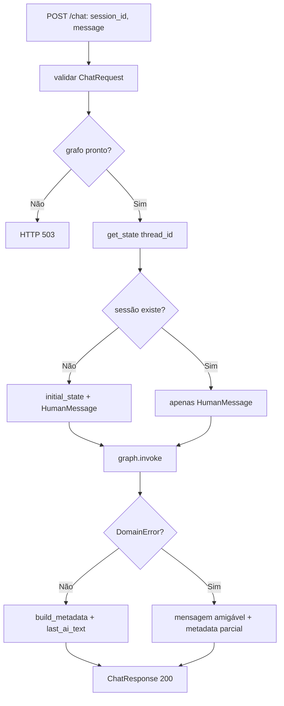
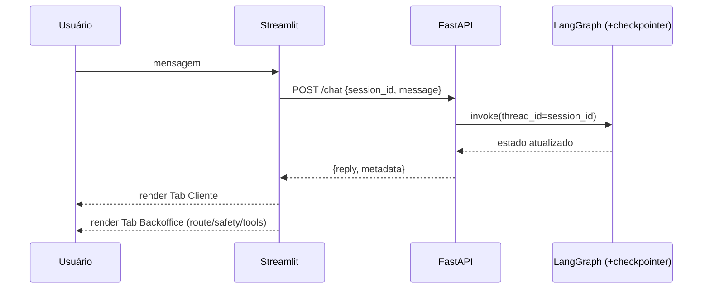

# Parte 3 — Fluxogramas: API + Interface

> Status: 🟡 = rascunho da estratégia · ✅ = validado no código · 🔲 = pendente.
> Referência de escopo: [`../../PROMPT-IMPLEMENTACAO.md`](../../PROMPT-IMPLEMENTACAO.md) (Parte 3).
>
> **Parte 3 implementada e validada** (`test_api` verde).

---

## API

### `api.routes.chat.chat` (`POST /chat`) — ✅

### Interação end-to-end (camadas) — ✅

---

## UI

### `ui.streamlit_app` — ciclo de interação — ✅

