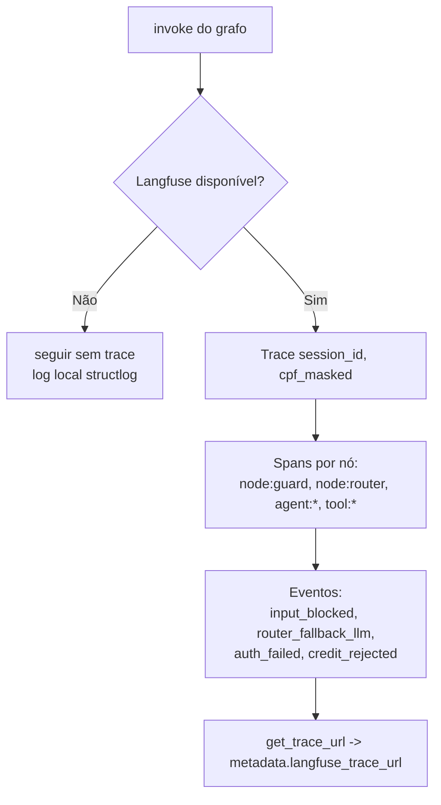
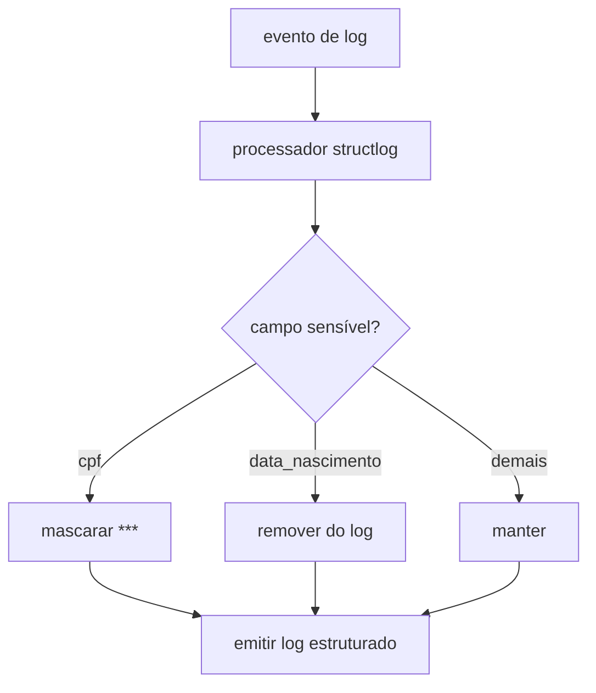
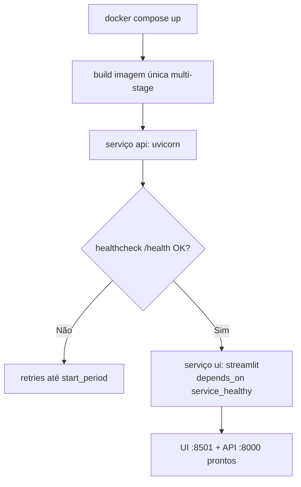

# Parte 4 — Fluxogramas: Observabilidade, Hardening e Entrega

> Status: 🟡 = rascunho da estratégia · ✅ = validado no código · 🔲 = pendente.
> Referência de escopo: [`../../PROMPT-IMPLEMENTACAO.md`](../../PROMPT-IMPLEMENTACAO.md) (Parte 4).

---

## Observabilidade

### `infrastructure.langfuse_tracer` — trace/spans/eventos — 🟡

### `observability.logging` — redaction de PII — 🟡

---

## Infraestrutura de entrega

### `docker-compose` — ordem de subida — 🟡

