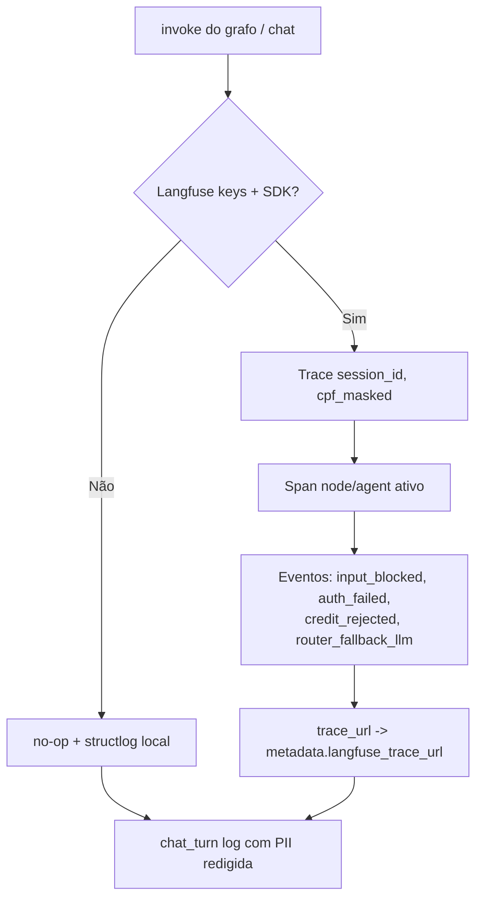
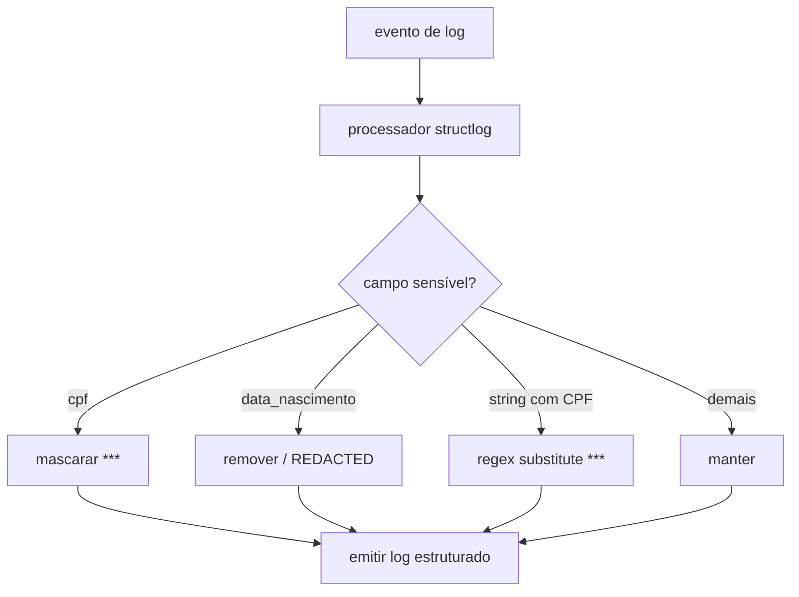
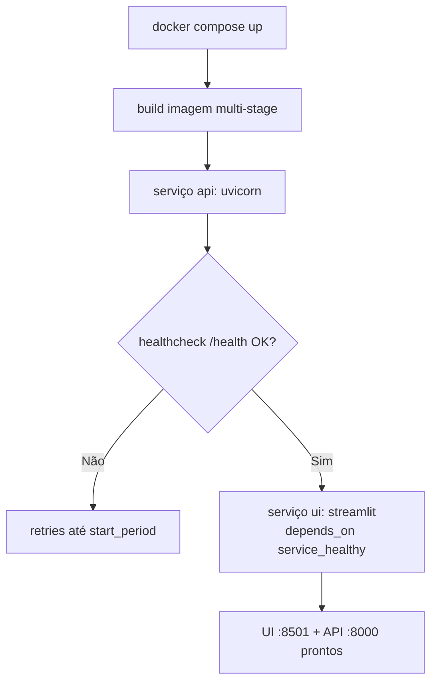

# Parte 4 — Fluxogramas: Observabilidade, Hardening e Entrega

> Status: 🟡 = rascunho da estratégia · ✅ = validado no código · 🔲 = pendente.
> Referência de escopo: [`../../PROMPT-IMPLEMENTACAO.md`](../../PROMPT-IMPLEMENTACAO.md) (Parte 4).
>
> **Parte 4 implementada e validada** (redaction + tracer no-op + suíte verde).

---

## Observabilidade

### `infrastructure.langfuse_tracer.SessionTracer.record_turn` — ✅

### `observability.logging.redact_pii` — ✅

---

## Infraestrutura de entrega

### `docker-compose` — ordem de subida — ✅

